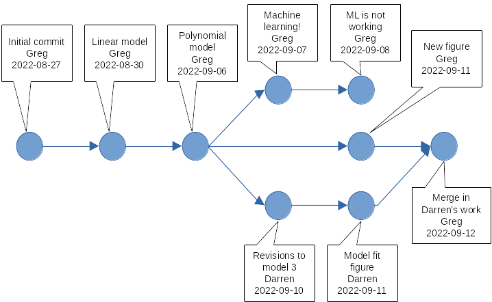

```{r, setup1, include=FALSE}
knitr::opts_chunk$set(echo = TRUE)
```

```{bash, setup2, include=FALSE}
mkdir ~/awesomeproject
touch ~/awesomeproject/data.csv ~/awesomeproject/analysis_script_final.1.R \
~/awesomeproject/analysis_script_final.R ~/awesomeproject/analysis_script_v1.R \
~/awesomeproject/analysis_script_v2.R ~/awesomeproject/analysis_script_MLtest.R \
~/awesomeproject/analysis_script_Darren.R ~/awesomeproject/analysis_script.R

mkdir ~/awesomeproject_git
touch ~/awesomeproject_git/analysis_script.R ~/awesomeproject_git/data.csv
cd ~/awesomeproject_git
git init
echo "This is my script" >> analysis_script.R
git add analysis_script.R
git commit -m "Initial commit - add analysis script"
echo "Add a linear model" >> analysis_script.R
git add analysis_script.R
git commit -m "Fit linear model to the data"
echo "Add a polynomial model" >> analysis_script.R
git add analysis_script.R
git commit -m "Fit polynomial model"
echo "Make some figures" >> analysis_script.R
git add analysis_script.R
git commit -m "Statistics and figures for report 1"

# Note that we also have to create the `my_gh_repo` and fork the
# JEDS repository on GitHub - all to the gremau account - for this to knit.
```

# 1. Getting to know Git

## What is Git?

* free & open-source distributed version control system (DVCS)
* first authored by Linus Torvalds for development of the Linux kernel
* very widely used to "version control" software dev projects
* excels at tracking changes to computer code files (plain text)
* good for collaborative workflows

## Why use version control as a researcher? {.build}

* scientists write lots of computer code and documentation
* we revise things often
* paths of inquiry get abandoned, or revisited later
* scientists work collaboratively
* research projects evolve and diversify with time

Research can become a "garden of forking paths"

**Version control records changes and helps manage the complexity**

## Inside a "simple" data analysis project

```{bash, awesomeproject}
ls ~/awesomeproject/
```

The researcher has gone down different paths, each resulting in a new file:

* linear, polynomial, and machine learning models
* input from a collaborator
* a "final product" for a report or paper

## Using Git simplifies things 

```{bash, awesomeproject_git}
# The -a lists hidden files like .git
ls -a ~/awesomeproject_git/
```

This is a _**Git repository**_ for the same analysis project

* There is only one script (`analysis_script.R`).
* Git commands (`git ...`) help manage and version control files.
* Changes to the script (and other files) are recorded in the `.git` directory.

## What is recorded in `.git/`?

**Git keeps track of what changed in `analysis_script.R`, who changed it, when it changed, and why (_as long as you tell it to_).**


## Some terminology

>- ***repository***: a directory with a history of changes recorded by Git,
meaning it must contain a `.git` subdirectory.
>- ***commit***: Git's basic unit of version control that records *exactly* which
lines changed in which files, and how, plus annotations about person, time, etc.
>- ***version***: the state of repository files produced by a particular line of
development that includes one or more commits to the repository
>- ***branch***: a version of repository files that diverges (with separate
commits) from the main line of development (the `main` branch) in the repository
>- ***fork***: a complete copy of a Git repository that then undergoes
divergent changes from the original

## An annotated list of "commits" {.smaller}

```{bash, commits}
git -C ~/awesomeproject_git/ log
```

```{r, cleanup_1, include=FALSE}
unlink('~/awesomeproject', recursive=TRUE)
unlink('~/awesomeproject_git', recursive=TRUE)
```

# 2. Now try some Git basics

## Finding and configuring `git`

We will do this in the system shell. So, open a terminal with `bash`, `zsh`,
or another shell (you may have installed one with Git on Windows), and then
type the following command.

```{bash, check_for_git}
git --version
```
If you got the output above, or similar, you have Git installed and it is
available with `git` commands in your shell. If you didn't get that output
you need to return to the [setup instructions](../html/setup.html) and install
Git for your system.

If Git is newly installed on your system, you probably need to configure a
couple of things. As you start using `git` commands, it helps to know that they
usually follow a `git verb options` pattern, where `verb` is the action you need
to take, and `options` give some specifics of how to do the action. For 
configuration, lets first, tell `git` who you are.

```{bash, tell_git_who_u_are, eval=FALSE}
git config --global user.name "Marie Curie"
git config --global user.email "marie@sorbonne.fr"
```

There are some differences in how computer platforms handle line endings
in text files. Correspondingly, you will want to tell Git how to handle this for
you, and the configuration for MS Windows machines will be different than for
Mac and Linux machines. For Mac and Linux, the recommended setting is:

```{bash, line-endings_mac, eval=FALSE}
git config --global core.autocrlf input
```

And for Windows it is:

```{bash, line-endings_win, eval=FALSE}
git config --global core.autocrlf true
```

Since we'll be using GitHub, which names its repository main branches `main`,
we should make sure our local `git` follows the same convention.

```{bash, config_main, eval=FALSE}
git config --global init.defaultBranch main
```

Finally, you might also want to configure Git to use your favorite text editor
for writing commit messages. More information about that [here](https://swcarpentry.github.io/git-novice/02-setup/index.html).

You can show your Git configurations anytime with `git config --list` command.

## Making your first repository

Now lets make a new directory and add a text file to it. We will turn this into
a Git repository in a moment.

```{bash, start_repo}
mkdir ~/my_repo
touch ~/my_repo/script.R
cd ~/my_repo
```
```{r, setup3, include=FALSE}
# Have to change working directory
knitr::opts_knit$set(root.dir = '~/my_repo')
#setwd('~/my_repo')
```

Now that we are in our project directory, lets make it a Git repository

```{bash, init_repo}
git init
```

We can use the `ls -a` shell command to see if we made a `.git` directory to
to store the changes we will make to our files.

```{bash, list_repo}
ls -a
```
The `.git/` directory is there. Now lets ask Git to tell us the status of our
repository.

```{bash, repo_status}
git status
```

We are on the `main` branch, there are no commits yet, and there is a file that
we made - `script.R` - that is not being tracked. 

## Adding files and tracking changes

Lets tell Git to track that file. We do that with the `add` verb, which 
"stages" the file to be added to a new commit.

```{bash, stage_file}
git add script.R
```

If we want to check the status now, we'll see that `script.R` is staged to be 
added as a new file, under the "Changes to be committed" list.

```{bash, status_staged}
git status
```

This staging step lets you compose multiple changes to your repository files 
into a group of updates to your history (sometimes called a change-set). When
we are ready to add these changes, for us just one new file, to our `git`
repository, we `commit` the changes to the repository, which will store the
initial version of our file in Git's history.

```{bash, commit_file}
git commit -m 'Adding the first R script'
```

Sooner or later we'll add something to this file, and we'll want to commit those
changes to the repository as well. **Open up your `script.R` file in a text editor
and add a couple lines of "code", then save this file again**. After it is saved
you can check your repository status with `git status` again.

```{bash, add_lines, include=FALSE}
echo "Load the data..." >> script.R
echo "Fit a linear model..." >> script.R
```

```{bash, status_script}
git status
```

This tells us that `script.R` was modified, but those changes haven't been
staged yet. To get line-by-line details about what changed in your file, you can
"diff" the file to show the difference between the last committed version, and
what it looks like after you added some code.

```{bash, diff_script}
git diff script.R
```

The lines prepended with a `+` show what has been added since the last commit.
Lines starting with `-` would show you what was removed, but we haven't removed
anything. This seems like a reasonable change, so lets stage the updated file
with `git add` and add it to our repository with `git commit`.

```{bash, commit_script}
git add script.R
git commit -m 'I updated the script with 2 lines'
```

Take note that when you commit something to your repository's history it is wise
to explain what was changed using a "commit message" That is what we are doing
with the `-m` option followed by a quoted message. Commit messages are invaluable
in helping you understand how and why your repository is changing, so before
you commit something, put a little thought into how you will describe the changes.

Lets take a quick look at our history now:

```{bash, log_after_changes}
git log
```

We can see our progress so far. There are two commits, with the first adding the
new `script.R` file, and the second one adding a couple of lines to it.

```{r, setup_4, include=FALSE}
knitr::opts_knit$set(root.dir = '~/GitHub/JEDS/episodes')
```
```{r, cleanup_2, include=FALSE}
unlink('~/my_repo', recursive=TRUE)
```

# 3. Getting to know GitHub

## What is GitHub?

* <https://github.com>
* Software development and collaboration platform
* A host for `git` repositories with web-based tools for working in a highly
networked, collaborative way
* Owned by Microsoft now
* Very widely used

## How to use GitHub

**Interact with the GitHub website with a browser**

* For example, [this tutorial](https://github.com/jornada-im/JEDS/tree/main/episodes) is in a repository on GitHub.
* With an account you can create `git` repositories and much more.

**Clone or sync changes (`push` and `pull`) with GitHub repositories using `git`**

```{bash, clone_GitHub_ex, eval=FALSE}
git clone https://github.com/jornada-im/JEDS.git
```

**GitHub also has a bunch of APIs, a command-line tool, GitHub Desktop...**

## When should researchers use GitHub?

* If you do scientific computing/software development
* For collaborative...
  - data analysis
  - writing
  - project management
  - teaching
  - (and computing/software dev)
* Personal/professional/project/educational websites
* Automating tasks


# 4. Basics of GitHub repositories

## Create and clone a GitHub repository

Lets create a repository on GitHub, initialize it with some files, and then use
our local `git` commands to pull the new repository to our computer. We can then
make some changes and push them back to GitHub.

1. Log into <https://github.com> with your account credentials (or make an 
account if you didn't in advance).

2. Press the little green <button style="background-color:green;border-color:green;color:white">New</button> button to create a new repository

3. Name the repository `my_gh_repo`

4. Check the box to "Add a `README` file"

5. Click the <button style="background-color:green;border-color:green;color:white">Create repository</button> button

Now your repository is created and you should be in its landing page. To move
the new repository to your local machine, you must "clone" it from GitHub.
First make a place on your local machine to put the repository. Return to your
system shell and make a new directory called `GitHub` to hold local repositories
you clone from GitHub.

```{bash, mkdir_GitHub, eval=FALSE}
mkdir GitHub
```

Now you need to use `git` to clone `my_gh_repo` from GitHub using its web
address. Returning to your repository page (<https://github.com/{username}/my_gh_repo>),
look in the top right of this repository's landing page, and there is a
<button style="background-color:green;border-color:green;color:white">Code</button> button. Click it to open a dialogue that gives you the option to copy an
address. Use the "HTTPS" option and press the "Copy" button to the right of the
address (2 overlapping squares). The address for your repository is now in your
system clipboard. Return to your shell, navigate to the `GitHub` directory, and 
`git clone` the repository at that address:

```{bash, clone_my_gh_repo, eval=T}
cd ~/GitHub/ #Note: you can put GitHub/ somewhere other than the home directory (~)
git clone https://github.com/gremau/my_gh_repo.git
```

Now you should have a clone, or copy, of the `my_gh_repo` repository you just 
made that is ready to work with in your local `GitHub/` directory. Lets enter
that directory and look around.

```{r, setup_5, include=FALSE}
# Keep the correct path
knitr::opts_knit$set(root.dir = '~/GitHub')
```
```{bash, look_at_clone, eval=T}
cd my_gh_repo/
ls -a
```

We can see the `README.md` file that we created on GitHub, plus the `.git` folder
ready and waiting for us.

## Make changes and push to GitHub

Lets make some changes to our new repository on our local system. Use a text
editor to open up the `README.md` file inside your `my_gh_repo` repository
folder and add a couple new lines of text. Once you do, Git should notice the
change when checking the repository status.

```{r, setup_6, include=FALSE}
# Keep the correct path
knitr::opts_knit$set(root.dir = '~/GitHub/my_gh_repo/')
```
```{bash, change_gh_repo, include=FALSE}
echo "This repository does this" >> README.md
echo "This repository does that" >> README.md
```

```{bash, new_repo_status}
git status
```

Notice that `git status` now tells us the repository status in relation to the
"origin". The `origin` is a remote repository that your local copy is linked to,
in this case the repository on GitHub that we cloned from. We can list our
remote repositories, and inspect the origin with the `git remote` command.

```{bash, check origin1}
git remote -v # -v is for "verbose"
```

This tells us we have one remote repository, called `origin`, and we can push to
and pull from this repository. We can also see some other details about
branches, and where the push and pull operations will go.

```{bash, check origin2}
git remote show origin # This gives details of origin
```

Getting back to the changes we made, if we are content with our local changes we
can stage them and commit them.

```{bash, new_repo_commit}
git add README.md
git commit -m "Added two lines to the README file"
```

Great! But now our local clone of the repository has a commit that is not at the
`origin` repository on GitHub. How do we fix this? First lets look at what
`git status` says.

```{bash, new_repo_status2}
git status
```

Our local repository is one commit ahead of `origin` now. To bring the GitHub
repository up to date, we need to `git push` the changes there. Note that this
isn't going to work unless you have something called a "Personal Access Token"
(PAT), or have configured SSH access to GitHub. We can quickly create a PAT on
GitHub with these steps (taken from [here](https://docs.github.com/en/authentication/keeping-your-account-and-data-secure/creating-a-personal-access-token)):

1. Go back to <https://github.com> - you should be logged in with your account
credentials already

2. Open the dropdown at the very top right corner of your page to see GitHub 
user account options, and choose **Settings**.

3. In the left sidebar choose **Developer settings**

4. In the left sidebar (again) choose **Personal access tokens**

5. Give it a name, expiration date, and give the token `repo` access by checking
the first check box under **Select scopes**

6. Click the <button style="background-color:green;border-color:green;color:white">Generate token</button> button at the bottom, and then copy the resulting token to
your clipboard (the copy button is the overlapping squares again).

For now, SSH access is beyond the scope of this tutorial, but it is highly
recommended. [See here](https://swcarpentry.github.io/git-novice/07-github/index.html#3-ssh-background-and-setup) to learn how to set up SSH access for your machine
and GitHub.

Now that you have copied the token you can use `git push` to push the changes
to `origin` on GitHub. You will be asked for your username and password. For the
password you will paste the PAT token into the terminal.

```{bash, push new_repo, eval=FALSE}
git push
# Username for 'https://github.com': {enter your GitHub username}
# Password for 'https://gremau@github.com': {PASTE the "PAT" here}

```

If this is successful, the most recent commit adding two new lines to the README
file will be added to the GitHub repository, thus syncing up the local and
remote versions of our files.

```{r, setup_7, include=FALSE}
knitr::opts_knit$set(root.dir = '~/GitHub/JEDS/episodes')
```
```{r, cleanup_3, include=FALSE}
unlink('~/GitHub/my_gh_repo', recursive=TRUE)
```


# 5. Collaborative work with Git and GitHub

## "Forking" a repository

You can copy any public repository on GitHub to your own account by "Forking" 
the repository. Essentially, this creates a clone of someone else's repository
for you, in your own GitHub account. To demonstrate this, lets clone the repository 
that contains this tutorial (`jornada-im/JEDS`). Return to GitHub in your browser
and follow these steps.

1. Navigate to <https://github.com/jornada-im/JEDS>
2. In the upper right of the repository page click the "Fork" button between
"Star" and "Watch".
3. You'll have the option to change the name and owner, but you can leave
everything as it is and click the <button style="background-color:green;border-color:green;color:white">Create fork</button> button, which will create the fork and take you to its landing page.

You'll now have a fork of the "JEDS" repository in your own GitHub account
(`your_username/JEDS`). In the upper left of the page, under the repository name
you should see a link back to the original repository ([`jornada-im/JEDS`](https://github.com/jornada-im/JEDS)). Now lets clone this to
our local GitHub folder and make some changes.

On your new JEDS repository fork page, click the <button style="background-color:green;border-color:green;color:white">Code</button> to
open the dialogue, then select "HTTPS", and copy the link to the repository (copy 
with the overlapping squares). Now clone that into your GitHub directory.

```{bash, clone_JEDS2, eval=T}
cd ~/GitHub/
git clone https://github.com/gremau/JEDS.git JEDS_fork #JEDS_fork is optional
```
```{r, setup_8, include=FALSE}
knitr::opts_knit$set(root.dir = '~/GitHub/JEDS_fork')
```

Now you have a local copy of your fork (`your_username/JEDS`). If you want to
interact with the original repository (`jornada-im/JEDS`) then we need to make sure
there is a link to that. Lets go to that repository

```{bash, cd_JEDS2, eval=FALSE}
cd JEDS_fork/
```

and check the status of our remote repositories.

```{bash, remotes_JEDS2, eval=T}
git remote -v
```

It looks like our only "remote" repository is our fork on GitHub
(`your_username/JEDS`). This is OK, but not ideal for collaboration purposes. It
would be better if we also had the original repository (`jornada-im/JEDS`)
configured as an "upstream" source repository. This way, we could pull any changes
made to the source repository directly into our local clone. Instead, we
currently need to do this indirectly through GitHub. There are several ways to
configure an upstream source repository (see [methods in Happy Git](https://happygitwithr.com/fork-and-clone.html#fork-and-clone-finish) for
example), but we're going to set that aside today and focus on the simplest
possible method to make changes.

## Branching and pushing to forks

Lets continue by making some changes to a local file in our fork of the JEDS
repository. Before we do this, we should create a **branch** to make the 
changes in. A branch is a separate, named path of development within a
repository. When we create a branch and make changes in it, they do not effect
the `main` branch until we decide to `merge` them in. Creating and working with
branches in `git` is simple, just create a new named branch and then `git checkout`
the branch to begin work there.

```{bash, branch_JEDS2, eval=T}
git branch my_changes
git checkout my_changes
```

You could also use a shorthand command for this - `git checkout -b my_changes`.
We have now created a branch within our repository, called `my_changes` that we
can develop without changing anything in `main`. This is a great way to partition
your changes until you are sure your changes work well with the rest of the
repository. 

Now lets make those changes. Look inside the `episodes` folder and find the
`learner_changes.md` file.

```{bash, find_JEDS2_file, eval=T}
ls episodes/
``` 

Open this file in a text editor and and correct some of the problems in the
spelling or the code. Save your changes and then stage and commit the changes.

```{bash, change_JEDS2_repo, include=FALSE}
echo "This repository does this" >> episodes/learner_changes.md
echo "This repository does that" >> episodes/learner_changes.md
```
```{bash, commit_JEDS2_file, eval=T}
git add episodes/learner_changes.md
git commit -m 'I made this file better'
``` 

We have committed the changes to the `my_changes` branch. If we want to share
these changes, the new branch will need to be accessible to others in the forked
GitHub repository (`your_username/JEDS`). To publish the `my_changes` branch to 
GitHub we can use a variation on `git push` that creates an "upstream" branch in
the origin repository (again - `your_username/JEDS`).

```{bash, push_JEDS2_file, eval=T}
git push --set-upstream origin my_changes
``` 

Now if we return to GitHub, we can see that the new branch has been added to the
repository there, and it will contain any changes we made to 
`episodes/learner_changes.md`. If we want to contribute the changes in our new
branch back to the source repository (`jornada-im/JEDS`), we can issue something
called a "pull request" in GitHub, which notifies the maintainer of the source repository that somebody wants to merge changes into it.

## Issuing pull requests

When you have made changes to a forked repository on GitHub, you have the 
opportunity to contribute those back to the source repository. GitHub makes this
operation, called a "Pull request," available in a number of ways. 

Return to your fork of the JEDS repository on GitHub (https://github.com/{your_username}/JEDS)
and look for the `my_changes` branch. By default you will be viewing the 
`main` branch, which should be apparent in the dropdown menu to the top
left of your repository's code. You may also see a banner notification about the
recent push to the `my_changes` branch that you just did. To view the `my_changes`
branch, you can either follow the link in the banner, or use the dropdown to
select the `my_changes` branch.

Once you select the new branch, the repository page will change slightly and
you can now view all files in `my_changes`. If you like, open `episodes/learner_changes.md`
to see that your modifications to the file are there (they are not in `main`).
You will also notice a banner above the code that says "**This branch is 1 commit
ahead of jornada-im:main**" with options to "Contribute" or "Sync." This is
telling you that the `my_changes` branch in your fork has one commit that is not
present in the original source you forked from, the `main` branch of [`jornada-im/JEDS`](https://github.com/jornada-im/JEDS).
To contribute your changes back to this source, you can issue a pull request by
clicking the "Contribute" dropdown and selecting the <button style="background-color:green;border-color:green;color:white">Open pull request</button> button.

When you open the pull request, notice that the new pull request template opens
in the `jornada-im/JEDS` repository. GitHub will then check whether your branch
can be merged into the `main` branch of this source repository. If it can, you
will see the exact changes that will be made, and you have the opportunity to
add a comment that will be seen by the person who will receive your pull request
(whoever maintains the source repository, in this case Greg). When you have
provided your comments and reviewed the pull request press <button style="background-color:green;border-color:green;color:white">Create pull request</button>
and the maintainer of `jornada-im/JEDS` will be able to respond to it by making
further comments/requests, merging it into the source repository, or rejecting
it. 

```{bash, cleanup_4, include=FALSE}
git push -d origin my_changes
git checkout main
git branch -D my_changes
```
```{r, setup_9, include=FALSE }
knitr::opts_knit$set(root.dir = '~/GitHub/JEDS/episodes')
```
```{r, cleanup_5, include=FALSE}
unlink('~/GitHub/JEDS_fork', recursive=TRUE)
```
```{bash, cleanup, include=FALSE, eval=FALSE}
#gh repo create my_gh_repo --public
#rm -r ~/awesomeproject_git;
#rm -r ~/my_repo;
```
